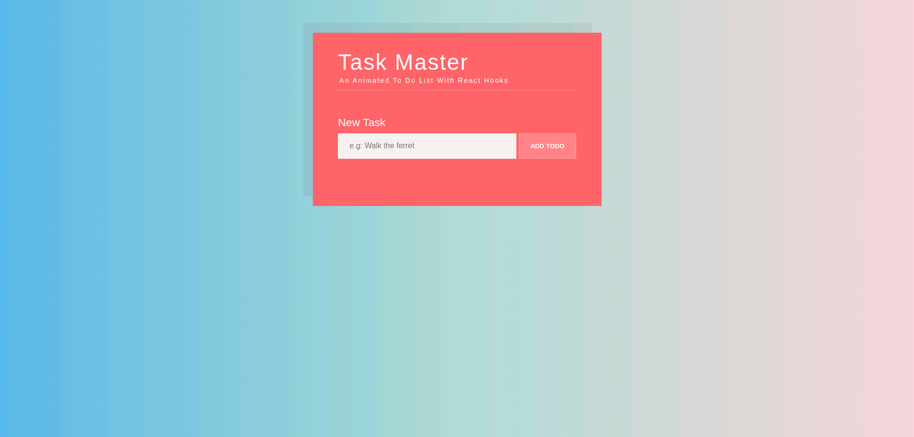

# Task Master

An animated to do list with react hooks, bootstrapped with [Create React App](https://github.com/facebook/create-react-app).



## Instructions:
1. Clone the project
   ``` git clone https://github.com/RedBalloon24/react-todo-list ```
2. Open the project and install the necessary dependencies
    ``` npm i ```
3. Run the following command in the terminal:
   ``` npm start ```
4. If the project does not automatically open, open [http://localhost:3000](http://localhost:3000) in the browser. 
5. ENJOY!!!